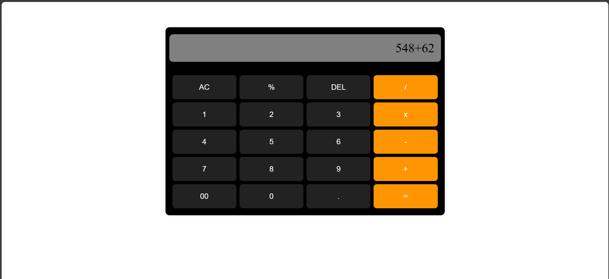

# Calculator
Basic Calculator 
# Calculator

A simple, modern web-based calculator built with HTML, CSS, and JavaScript.

## Features
- Basic arithmetic operations: addition, subtraction, multiplication, division
- Percentage, clear (AC), delete (DEL), and decimal point support
- Responsive and visually appealing design

## Usage
1. Clone or download this repository.
2. Open `index.html` in your web browser.
3. Use the calculator by clicking the buttons.

## File Structure
- `index.html` — Main HTML structure for the calculator
- `styles.css` — Styling for the calculator UI
- `script.js` — Calculator logic and interactivity
- `README.md` — Project documentation

## Demo

## Customization
- You can modify `styles.css` to change the appearance.
- Extend `script.js` to add more advanced features.

## License
This project is licensed under the MIT License.
