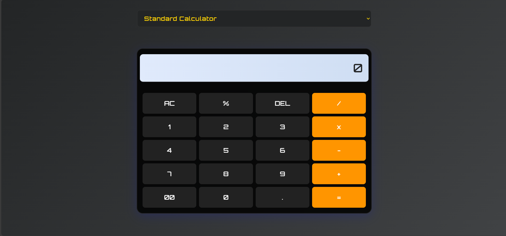

# Calculator Suite

A modern, multi-tool web calculator built with HTML, CSS, and JavaScript.

## Features
- Standard Calculator: Basic arithmetic operations (add, subtract, multiply, divide), percentage, clear (AC), delete (DEL), and decimal point support
- BMI Calculator: Calculate your Body Mass Index and get a health category
- Loan Interest Calculator: Compute monthly and total payments for loans
- Currency Converter: Convert between USD, EUR, INR, and GBP (static rates)
- Weight Converter: Convert between kilograms, grams, pounds, and ounces
- Clean, responsive, and visually appealing UI with a tech-inspired theme
- Menu to easily switch between tools

## Usage
1. Clone or download this repository.
2. Open `index.html` in your web browser.
3. Use the menu at the top to select the tool you want.
4. Enter your values and get instant results.

## File Structure
- `index.html` — Main HTML structure and tool menu
- `styles.css` — Modern styling for all tools
- `script.js` — Calculator and converter logic
- `README.md` — Project documentation

## Demo

## Customization
- Modify `styles.css` for different color schemes or fonts
- Extend `script.js` to add more currencies, units, or features

## License
This project is licensed under the MIT License.
